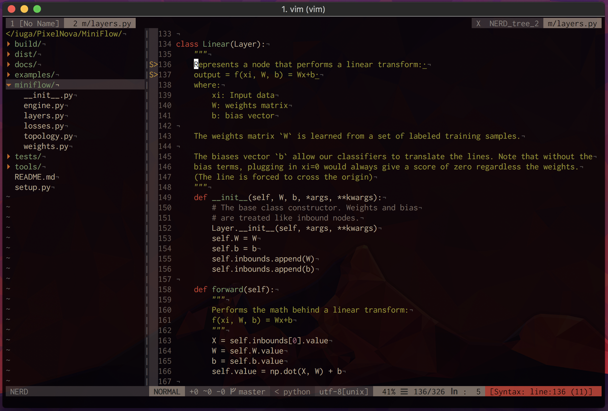

# My NeoVim Config
My NeVim configuration for Python/Go development



## Perks and Skills

- Great Color scheme ;)
- Airline
- Syntastic
- CtrlP + QuickFix
- Vim-Multiple-Cursors
- Python and Go Lang development
- NERDTree

## Basic Usage
- `Ctrl + t`: New Tab
- `Ctrl + p`: Toggle and search files in the project
- `gp`: Search functions, classes or methods
- `Ctrl + n`: Select all the word occurrences and edit them in bulk
- `Ctrl + \`: Toggle the navigation bar using NERDTRee
- `Shift + Left/Right Arrow`: Move between tabs
- `Ctrl + [hjkl]`: Move between the splits
- `Ctrl + F`: Search the word in the entire project using Rg.

## Installation
1. Install dependencies
```bash
# Ubuntu
sudo apt-get install vim ack-grep
# MacOs
brew install vim ack
# CoC Autocomplete
brew install node
```

2. If NeoVim

```bash
vim ~/.zshrc 
# Then add:
# Aliases
alias vim="nvim"
alias vi="nvim"
alias v="nvim"
alias oldvim="vim"
```

3. Install Vundle & Plugins
```bash
git clone https://github.com/VundleVim/Vundle.vim.git ~/.vim/bundle/Vundle.vim
vim +PluginInstall +qall
mkdir ~/.vim/colors
cp ~/.vim/bundle/gruvbox/colors/gruvbox.vim ~/.vim/colors/
```

4. Install the autocomplete engines

```bash
:CocInstall coc-go coc-python
```
