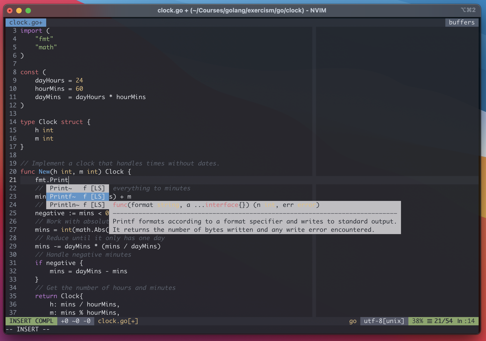

# vim-config
My vim configuration for Python development



## Perks and Skills
- Great Color scheme ;)
- Airline
- CtrlP
- Vim-Multiple-Cursors
- Syntastic
- Ack
- PEP8 check on save
- NERDTree

## Basic Usage
- `Ctrl + \`: Toggle the navigation bar using NERDTRee
- `Ctrl + p`: Toggle and search files in the project
- `Ctrl + n`: Select all the word occurrences and edit them in bulk
- `Ctrl + t`: New Tab
- `Shift + Left/Right Arrow`: Move between tabs
- `Ctrl + f`: Search the word in all the project
- `Ctrl + [hjkl]`: Move between the splits

## Installation
1. Install dependencies
```bash
# Ubuntu
sudo apt-get install vim ack-grep
# MacOs
brew install vim ack
```

2. Install Vundle & Plugins
```bash
git clone https://github.com/VundleVim/Vundle.vim.git ~/.vim/bundle/Vundle.vim
vim +PluginInstall +qall
```
